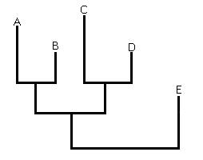
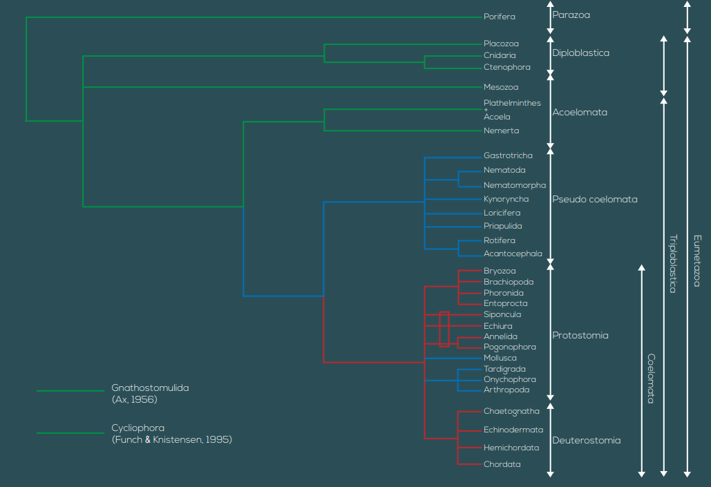

```{r setup, include=FALSE}
knitr::opts_chunk$set(echo = TRUE)
```

# Plan du cours

* Plans de structures des 32 phylas principaux (organes par exemple)
les structures sont souvent communes (SN, TD, appareil reproducteur,...) mais ont des spécificités différentes

* Évolutions de différents groupes
toutes les slides sont sur moodle, 2 syllabis en bac2

* TP: décrire, dessiner des organismes (entiers/vivants/coupes/...) pour apprendre les structures, dissections, ....
slides et rapports sur moodle

* programme de visualisation 3D disponible sur le site du laboratoire de biologie marine > bio-mar.com (MetaMorphos)

# Notions de bases (révision)

* Les animaux sont des organismes vivants pluricellulaires hétérotrophes, qui, après la reproduction, passent par le stade d'un oeuf, puis un stade morula, un stade blastula, et un stade gastrula (sauf les porifera qui ne passent pas par le dernier stade).

* Le monde vivant est divisée en 2 domaines: eucaryotes et procaryotes (monères). Le premier est divisé en 4 règnes: fungi, plantae, animalia (=metazoa) et protoctista. (Pour ce dernier groupe on retrouver les protozoa (hétérotrophes) et les protophyta (autotrophes), qui sont monocellulaires, ainsi que les algues (vertes rouges ou brunes) unicellulaires).

* La notion de ce qu'est un être vivant à fortement changé à travers le temps. Les premiers humains à avoir réfléchi à la question vont vite émettre la théorie animiste: est vivant tout ce qui bouge, croît. Cette théorie prévaudra de l'antiquité jusque la Renaissance. A cette période, la théorie mécanistique montera sur le devant de la scène: les êtres vivants sont composés de systèmes, d'organes, un peu comme une machine. Au XIXè-XXè siècles, la théorie biochimique sera prépondérante: les êtres vivants sont composés de molécules particulières: les molécules organiques (C-H). Ainsi, les êtres hétérotrophes consomment des molécules organiques pour leur propre biomasse, alors que les hétérotrophes sont capables de fixer le carbone minéral (CO2 par exemple).

* C'est au final Christian de Duve qui énoncera la base actuelle pour définir un être vivant: les êtres vivants croissent (ce qui implique: isolation par rapport au milieu extérieur, et puiser des molécules de ce milieu extérieur pour se nourrir) et se reproduisent (par reproduction sexuée ou asexuée).

# Échelle des temps géologiques


Phrase pour retenir: «Cambronne ordonna silence et dévotion à ses carabiniers permissionnaires».

La théorie actuelle sur l'apparition de la vie se repose sur la théorie Oparine-Haldane, qui, dans les années 20, théorisent que si l'atmosphère primitive avait une certaine composition, peut-être que des molécules organiques ont pu se former seules et ainsi la vie a pu apparaître seule. Cette théorie fut testée, entre autres, via l'expérience de Miller en 1953, qui montrera qu'il est en effet possible de créer des molécules organiques (urée, acides aminés, nucléotides, ...) à partir d'une atmosphère simple (CH4, H2, H2O, ....) et d'énergie (chaleur des sources thermale volcaniques océaniques, éclairs, ...). L'expérience de Ferris montre également que les acides aminés peuvent se polymériser d'eux-même pour former des protéines.


# Classification systématique/taxonomique et phylogénie/phylogenèse

La classification des êtres vivants nous vient Linné, naturaliste suédois, qui inventera notamment la systématique : classer les êtres vivants en formant des ensembles de plus en plus grands. L'unité de base de la systématique est l'espèce, après quoi on retrouve le genre, la famille, l'ordre, la classe, le phylum (ou embranchement), le règne et le domaine. 
Exemple: 
Pour l'homme: sapiens – Homo – hominidae – primates – mammalia – chordata – animalia – eukarya

Pour la veuve noire: mactans – Latrodectus – theridiidae – araneae – arachnida – arthropoda – animalia – eukarya

On peut noter qu'il existe parfois des «sous» , «infra», «super», etc... par exemple, la veuve noire fait partie du sous-embranchement des Chelicerata.

La phylogénie sert à montrer les relations de parentés entre différents organismes, pour laquelle on utilise des arbres phylogénétiques. On retrouve les cladogrammes:


Rectangulaire


Triangulaire

Où ABCDE sont des OTU: operating taxonomic units (espèces, familles, phylum,....)
Dans les cladogrammes, les OTU sont toutes au même niveau. On a donc par opposition les phylogrammes où l'on peut marquer les différents moments d'apparition de chaque OTU. Dans les deux cas, chaque nœud représente un ancêtre commun.



Ils furent notamment rendu possibles grâce au développement des méthodes utilisant l'ADN. Ainsi, depuis le début de la démocratisation des méthodes de séquençages ADN depuis le début des années 2000, les arbres phylogénétiques sont en plein remaniement, avec la création de nouveaux taxons, ....
Avec des arbres, il est important de noter la différence entre groupe monophylétiques, paraphylétiques, et polyphylétiques. 
Un groupe monophylétique comprend un ancêtre et tout ses descendants (un clade).


Un groupe paraphylétique comprend un ancêtre et une partie de ses descendants. Exemple: les reptiles, où l'on ommet souvent les oiseaux (quand on parle du clade, on parle des sauropsidés).


Enfin, un groupe polyphylétique comprend des OTU qui n'ont pas de liens directs (ex dans les cladogrammes précédents: A, D, E). C'est par exemple le cas des algues ou des pseudocoelomates. 

## Ancienne phylogénie animale: (pré-révolution ADN)




##Nouvelle phylogénie animale:


# Architecture animale

Nous allons étudier les plans de structure (Bodyplan, ou Baüplan), qui sont des formes d'organisations morphologiques qui caractérisent un taxon (Ici, des phylums).

Il existe 3 types de symétries chez les animaux: la symétrie bilatérale, qui est caractéristique des animaux qui se déplacent dans une direction précise, dans un «sens». Les organes sensoriels vont donc être orientés vers l'avant; la symétrie radiale, caractéristique des organismes fixés. Leurs organes sensoriels vont chercher de l'information tout autour de l'individu, pour détecter proies, dangers, .... Enfin, l'asymétrie, qu'on ne retrouve que du point de vue d'une colonie chez les phylums les plus primitifs (ex: porifères). Les individus eux-même conservent en général une symétrie radiaire.

Chez les organismes triploblastique, l'embryon possède 3 tissus principaux:

L'ectoderme: qui formera notamment l'épiderme, le système nerveux, le système excréteur (chez les invertébrés), une partie des branchies, et la bouche/le rectum.

Le mésoderme va former le derme, les muscles, les néphrons (reins), les poumons/branchies (en partie), le système sanguin, le système reproducteur, les gonoductes, ....

L'endoderme lui, va principalement former les poumons (en partie), et le tube digestifs (et glandes associées).

D'un point de vue d'organisation corporelle (attention, ce ne sont pas des taxons, comme «coelomates», mais des adjectifs!), on retrouve:

Les acoelomiens, qui n'ont pas de cavité
Les blastocoelomiens, où les cavités à l'age adulte proviennent du blastocoele (nématodes)
Les eucoelomiens, dont les cavités sont de vrais coelomes (annélidés, chordés, ...)

Par exemple, les mollusques sont des coelomates dans l'ancienne classification, mais ce sont des blastocoelomiens.

# Systèmes organiques

## Système digestif

Les autotrophes obtiennent leur matière organique (MO) à partir de carbone inorganique (ex, CO2). Les photoautotrophes tirent leur énergie du soleil (plantes), les chimioautotrophes de la décomposition de certaines molécules.

Les hétérotrophes, eux, obtiennent leur MO a partir de carbone organique. Tous les animaux sont, par définition, hétérotrophes, mais certains peuvent vivre en symbiose avec une algue (ex: certains coraux avec des zooxanthelles). 

Le tube digestif (TD) provient de l'archantéron. Il peut être complet (droit, ou en U) ou incomplet. 


Le TD est composé: d'une cavité bucale (pharynx), d'une oesophage, d'un estomac, d'un intestin, et d'un rectum. Tout au long du TD on trouve plusieurs glandes digestives (ex: foie).

Attention de bien faire la différence entre défécation (faire des fèces, via le système digestif) de l'excrétion (via le système excréteur).

## Système excréteur

Il sert à évacuer les déchets, et maintenir l'osmolarité.

On retrouve les ammoniotéliques, qui évacuent de l'ammoniac (notamment des invertébrés), les uréotéliques, qui évacuent de l'urée (NH2-(C=O)-NH2) (notamment les mammifères, les amphibiens, et les poissons cartilagineux), et les uricotéliques, qui évacuent de l'acide urique (principalement des individus qui veulent perdre le moins d'eau possible, comme les arthropodes. Une accumulation d'acide urique peut provoquer une crise de goutte).

Il y a plusieurs façons d'évacuer les déchets:
-Les reins (plus précisément des néphrons, chez les vertébrés)
-Des proto/méta néphridies
-Pour les individus peu épais, les cellules rejettent directement les déchets dans l'eau, pas de système excréteur au sens propre (ex: cnidaires, porifères).

## Système circulatoire

Vise à apporter les nutriments au bon endroit

On retrouve les systèmes sanguins, fermés (annélides, chordés) ou ouverts (mollusques, arthropodes), voire des espèces où la cavité digestive est un système digestif (exemple: cavité gastrovasculaire des cnidaires). Dans d'autres cas, le coelome lui même peut servir de moyen de transport des nutriments.


## Système respiratoire

Le système respiratoire sert à apporter l'oxygène là où il est nécessaire => cycle de Krebs. Il y a formation d'ATP, de NADPH et FADH2, qui servent à activer une chaîne d'électron qui créé un gradient de protons dans les membranes des mitochondries. L'oxygène sert ensuite de réducteur pour détruire les protons excédentaires.

Il y a 3 formes principales de respiration:
-La respiration transtégumentaire: l'oxygène diffuse directement à travers les tissus (individus peu épais)
-La respiration pulmonaire: Le poumon est un renflement de l'endoderme (et du mésoderme)
-La respiration branchiale: la branchie est un renflement de l'ectoderme (et du mésoderme)

## Système nerveux

Tous les animaux, à l'exception des porifera et placozoa (=parazoa) possèdent une forme de système nerveux, nécessaire à la coordination de l'individu. Il existe deux grands types de SN:

-Le plexus nerveux, principalement présent chez les diploblastiques


-Un système nerveux centralisé, basé sur une cellule particulière, le neurone

## Système hormonal

Le système hormonal permet de communiquer, soit avec ses propres cellules, soit avec d'autres individus (par exemple, pour stimuler la croissance, la production de gamètes, ...). Les hormones permettant de communiquer avec d'autres individus de la même espèce sont appelées phéromones (surtout chez les arthropodes), et celles pour communiquer avec des individus d'autres espèces sont appelées kairomones (ex: espèces symbiotiques).

## Système reproducteur

Les animaux se reproduisent principalement de deux manières: sexuée et asexuée
Pour la reproduction sexuée, on distingue les gonochoriques (reproduction dioïque) et les hermaphrodites (monoïques) (qui peuvent être simultanés, protandres ou protogynes).

Certains individus ont un cycle de vie direct: l'individu qui naît grandit directement vers sa forme adulte, soit indirect, avec un stade larvaire initialement, connaissant ensuite une métamorphose avant de devenirs adultes.

# Phylums


## Les parazoaires
Les parazoaires se distinguent des autres phylum par l'absence de jonctions cellulaires, et n'ont donc pas d'épithélium sensu stricto. On y retrouve les placozoaires et les porifères.


### Les placozoaires

Les placozoaires sont des individus hétérotrophes pluricellulaires (donc bien des animaux), et ils se nourrissent de nourriture en suspension, d'algues et de bactéries. Leurs cellules sont très peu différenciées. Lorsque leur population atteint une masse critique, ils réalisent une différentiation de certaines cellules entre spermatozoïdes et ovulent. Certaines études récentes les placeraient en réalité plus proches des cnidaires que des porifères. On dénombre seulement quelques espèces, dont Trichoplax adhaerens, découvert dans un aquarium en 1883. 
### Les porifères

Les porifères sont des parazoaires suspensivores actifs majoritairement coloniaux. Ils se nourrissent en attirant de la matière organique vers leurs cellules digestives en créant des courants d'eaux. Ils se reproduisent de manière sexuée via une fécondation interne et une incubation de l'embryon. Certaines espèces survivent pendant la saison froide au sein de gemmules, un sac contenant des cellules totipotentes, qui sont relâchées une fois des températures plus acceptables atteintes. Ils sont majoritairement marins, bien qu'il existe aussi plusieurs espèces dulcicoles. Un individu, au sein d'une colonie, est appelé un olynthe. Il existe 3 types de colonies: les types ascon, sycon, et leucons. 
Parmi les cellules ont trouve aussi des myocytes (capables de faire bouger l'éponge, par ex pour fermer les porocytes), et des spongocytes qui produisent de la spongine (protéine semblable au collagène qui remplit le mésohyle). Les archéocytes sont des cellules totipotentes qui participent à la digestion.

La reproduction des porifères est une fécondation interne: les individus mâles relachent des spermatozoïdes dans l'eau, qui sont absorbés par des individus femelles comme de la nourriture. Lorsqu'un spermatozoïde recontre un choanocyte, il est ingéré, le choanocyte perd son flagelle, et amène le gamète jusqu'à un ovocyte, qu'il féconde. L'oeuf est ensuite entouré par un archéocyte, et l'embryon commence son développement (corbeille vibratile). Les stades possibles sont: coeloblastula, stomoblastula+amphiblastula, ou parenchymule.

Taxonomie

* Symplaxia (cellules polynuclées)
  + Hexactinellida
    + Euplectella (Corbeilles de vénus)
* Cellularia
  + Calcarea
  + Démonspongia
    + Spongillida (ordre)
      + Spongillidae (famille)
        + Spongia (genre)
    + Clionaida
      + Clionaidae
        + Cliona

## Les diploblastiques
### Les cnidaires

Les cnidaires sont des animaux diploblastiques, donc doté de deux types de tissus embryonnaires, comportant environ 10 000 espèces. Ils sont essentiellement marins, bien que certaines espèces soient dulcicoles. Certains sont coloniaux (corail), d'autre solitaires (méduses). On estime que ce phylum existe depuis au moins 560 millions d'années. Le cnidaire typique passe par un stade polype, asexué benthique et fixé sur le substrat, et un stade méduse, sexuée et pélagique. On distingue 4 grandes classes majeures (en 2 sous phylum: les 3 premières classes font partie des médusozoaires, la dernière des anthozoaires):

* Les hydrozoaires, possédant gonozoïdes et gastérozoïdes (types de polype selon leur fonction), ils ont une morphologie très variée, et leur méduse est souvent de petite taille.

* Les sciphozoaires, les méduses au sens commun du terme, possèdent 4 bras autour de la bouche (manubrium), et des tentacules tout autour de l'ombrelle. La cloche ne possède cependant pas de cnidocytes. Le polype forme des méduses par strobilisation, en se découpant en plusieurs morceaux.

* Les cubozoaire sont des méduses de forme cubiques (cuboméduses), possédant des groupes de tentacules dans les angles du carré (pédalia). Elles sont très dangereuse, comme la chironex fleckerii, mortelle.

* Les anthozoaires ne possèdent pas de stade méduses. On y retrouve les anémones et les coraux. Ils sont divisés en hexacoralliaires (coraux durs, anémones, coraux noirs,...), et octocoralliaires (coraux mous, plumes de mer).

La cellule typique des cnidaires est le cnidocyte, qui contient un sac lançant un harpon lorsqu'un animal touche le cnidocil. Elle possède souvent un poison pour paralyser ou tuer sa proie.

Le cycle de vie typique est: Polype => reprod asexuée vers méduse => reprod sexuée vers larve plannula => grandit en polype. Les anthozoaires ne passent pas par le stade méduse cependant. Les polypes peuvent se reproduire de manière asexuée, par bourgeonnement, également.

#### Hydrozoaires

Polype Méduse


1)Cellule de recouvrement
2)Cnidocyte
3)Mucocyte (mucus)
4)Cellule sensorielle
5)Cellule interstitielle (totipotente)
6)Neurites (Plexus nerveux)
7)Cellules digestives
8)Cellule absorbante


	Les hydrozoaires forment des colonies atypiques de polype hautement modifiés :
	Les hydranthes et les gonange sont des polypes spécialisés. Les hydranthes peuvent servir à la défense, à la chasse, ... Les gonanges eux produisent des médusozoïdes, qui deviendront par la suite des méduses. Le périsarc, membrane de protection, n'est pas toujours présents. Les espèces en possédant sont appelées des thécata, et les autres des athécata. 

	Comme pour tous les cnidaires, les hydrozoaires peuvent vivre exclusivement en stade polype, exclusivement en stade méduse, ou une rotation de l'un vers l'autre (plus commun), avec ou sans clonage des polypes.
	Il existe cependant des exceptions, comme les condrophores (colonies flottantes, comme la physalie, ou velella velella), ou la famille des milleporidae, les coraux de feu.


B) Sciphozoaires

	Ce sont les méduses au sens commun du terme. Les plus grandes peuvent faire jusqu'à 2,5m de diamètre (cyanea capillata, méduse lion)


Elles possèdent donc notamment 4 bras manubriaux,n'ont pas de velum, et leurs gonades sont cette fois interne. Elles possèdent également des ropalies, dans lesquelles se trouvent des statocystes, cellules sensorielles. Elles possèdent parfois également des filaments entériques pour digérer.


	Les polypes donnent des jeunes méduses (nommées éphyres ou éphyrules) par strobilisation : le polype se découpe, morceau par morceau, pour donner une méduse pélagique. Les méduses, après reproduction, produisent des larves nommées planula (note : les hydrozoaires aussi), qui vont elle même donner un polype (nommé scyphistome quand juvénile).


C)Cubozoaires

Les cubozoaires passent par un stade méduse et polype, cependant, le polype se métamorphose au lieu de se strobiliser. La phase méduse a une forme cubique
